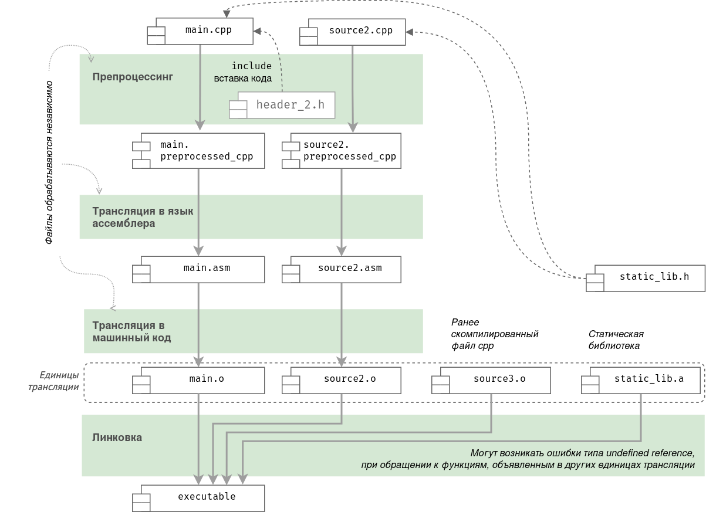
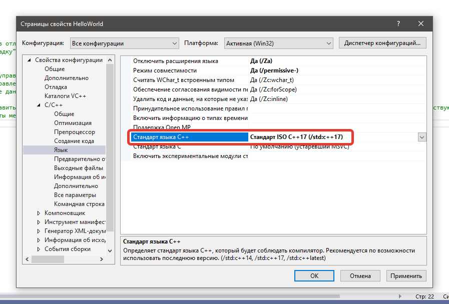

# Компиляция программы

## Компиляция программы из одного файла

Скомпилируем нижеприведённую программу (хранится в файле main.c) компилятором GCC.

```c
#include <stdio.h>
int main(){     
    printf("Hello, World!\n");
    return 0;   }
```

> **Примечание.** Во время работы в оболочке командной строки (например bash или PowerShell) будут полезны команды:
> - `ls` — показать файлы в текущей директории;
> - `cd <path_to_dir>` — изменить текущую папку на указанную (можно указать полный абсолютный или относительный путь);
> - `./my_program_name` — запустить программу из текущей папки.

```bash
gcc main.c -o hello_world.exe
```

- `main.c` — имя входного файла
- `-o` — параметр после которого указывается имя выходного файла. Здесь это исполняемый файл `hello_world.exe`

Полная поддержка новых стандартов языка C появляется в компиляторах часто спустя несколько месяцев или даже 1–2 года после публикации стандарта. Но отдельные, востребованные нововведения начинают поддерживаться относительно быстро. Однако по умолчанию компилятором используется не последний принятый стандарт, а более ранний. Для включения поддержки реализованных возможностей новых стандартов нужно отдельно указывать их название через параметр `std`:

```bash
gcc main.c -o hello_world.exe --std=c23
```


## Макросы препроцессора

[cppreference.com](https://en.cppreference.com/w/c/preprocessor/replace)

`__STDC_VERSION__` — хранит номер версии используемого стандарта языка. Может принимать значения:
199409L (C95), 199901L (C99), 201112L (C11), 201710L (C17), 202311L (C23) или похожие, в зависимости от компилятора.

Для стандарта C89 (ANSI C) макрос `__STDC_VERSION__` не определён; вместо него проверяют макрос `__STDC__`, который определён как 1 во всех версиях стандарта.

## Этапы компиляции

1. **Препроцессинг**. Обработка директив *препроцессора* C: `include`, `define`, `ifdef` и др. На этом этапе, в том числе, происходит вставка содержимого файлов, указанных в директивах `include` (рис. 1).
2. **Преобразование в ассемблерный код.**
3. **Преобразование в машинный код.** В результате создаются *объектные файлы* из всех `.c` файлов, переданных компилятору.
4. **Компоновка**. Компоновщик (линкер), используя *таблицу символов*, объединяет объектные файлы и файлы статических библиотек в исполняемый файл.

   *Таблица символов* — это структура данных, создаваемая самим компилятором и хранящаяся в объектных файлах. Таблица символов хранит имена переменных, функций, классов, объектов и т.д., где каждому идентификатору (символу) соотносится его тип и область видимости. Также таблица символов хранит адреса ссылок на данные и процедуры в других объектных файлах. Именно с помощью таблицы символов и хранящихся в ней ссылок линкер способен построить связи между данными множества объектных файлов и создать единый исполняемый файл.



*Рис. 1. Этапы компиляции (на примере C++)*

<!-- Источник: https://habr.com/ru/post/478124/ -->

Детальное описание процесса компиляции:
[cppreference.com](https://en.cppreference.com/w/c/language/translation_phases)

## Компиляция нескольких файлов и статической библиотеки

Предположим, что исходный код программы разбит на несколько файлов:

- `main.c` — основной файл, содержит функцию main.
- `my_unit1.h`
- `my_unit1.c`
- `my_unit2.h`
- `my_unit2.c`

Компиляция:

```bash
gcc main.c my_unit1.c my_unit2.c -o my_prog.exe
```

Отметим, что имена заголовочных файлов не передаются компилятору, потому что их код будет вставлен препроцессором в те места, где их имена указаны в директивах `include` (рис. 1).

Для ускорения процесса компиляции отдельные `.c` файлы можно скомпилировать заранее. Кроме того, исходный код таких файлов уже нельзя будет просмотреть. Эти файлы можно использовать как обычные `.c` файлы при компиляции, их код статически (на этапе компоновки) будет включён в исполняемый файл.

todo: пример компиляции библиотеки

[GitHub](https://github.com/VetrovSV/OOP/tree/master/examples/example_libs/simple_lib)

todo: пример компиляции со статической библиотекой

Динамическая библиотека — это отдельный файл, который не включается в исполняемый файл во время компиляции, а может быть подключён программой в любое время её выполнения. Эти файлы имеют расширение dll в Windows.

## Параметры компиляции, настройки компиляции в IDE

Некоторые параметры компилятора GCC (угловые скобки обозначают обязательный аргумент):

- `--version` — показать информацию о версии;
- `-o <my_output_filename>` — имя выходного (исполняемого) файла;
- `-I <include path>` — указывает путь к отдельной (дополнительной) папке с заголовочными файлами;
- `-L <library path>` — указывает путь к отдельной (дополнительной) папке со статическими библиотеками;
- `-l <library>` — указание необходимой статической библиотеки;
- `-O1, O2, O3` — оптимизации кода различного уровня (включая уменьшение размера файла); может замедлять компиляцию;
- `--std=<standard_name>` — указание стандарта языка: c17, c23 и др.

**Microsoft VisualStudio**

Чтобы получить доступ к страницам свойств, выберите «Свойства проекта» в главном меню или щелкните правой кнопкой мыши узел проекта в окне «Обозреватель решений» и выберите «Свойства» (рис. 2).



*Рис. 2. Окно свойств проекта Microsoft VisualStudio: настройка версии стандарта языка C*

<!--см. также раздел «Инструменты разработчика».-->
