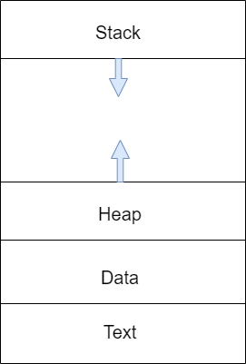

# Устройство памяти программы

- **Статическая память** (data на рис.). Хранит глобальные переменные.
- **Динамическая память** (heap, куча). Память, которая выделена оператором `new`.
- **Автоматическая память** (stack, стек). Хранит адреса возврата функций, локальные переменные, параметры функций.
  > Не стоит путать область памяти _стек_ с одноимённым типом данных и стеком процессора.
- **Сегмент кода** (text на рис.)



Использование оператора `new` внутри функции приводит к выделению памяти в куче. Но стоит дополнительно позаботиться, чтобы не потерять указатель на эту память, который может быть локальной переменной.

```cpp
void foo(){
    int * arr = new int [1024];
    // arr - указатель, локальная переменная находится в стеке.
    // 1024 элемента массива располагаются в куче

    // doing staff ....
}
```

После завершения функции `foo` исчезнет переменная `arr`. Уже будет нельзя ни освободить эту память, ни обратиться к ней — то есть произойдёт **утечка памяти**. Можно решить проблему, вернув адрес указателя:

```cpp
int* foo(){
    int * arr = new int [1024];

    // doing staff ...

    return arr;
}

int * array = foo();

// ...

delete[] array;
```

**Access violation**, **segmentation fault** — ...

**Стек вызовов** (call stack) — ...
